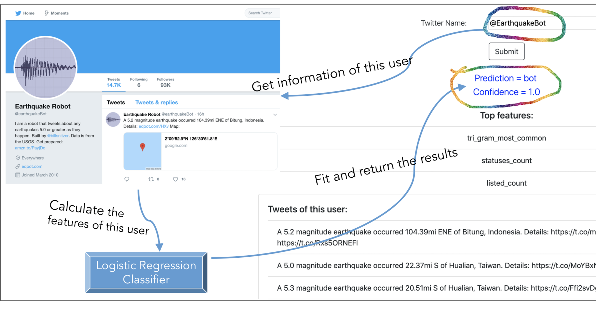

# Using Machine Learning to Spot a Twitter Bot

This project is for the [Elevate](https://admissions.iit.edu/elevate) course SCI 498 - 410: Online Social Network Analysis, taught by [Dr. Aron Culotta](http://cs.iit.edu/~culotta/) at the Illinois Institute of Technology.

Here is the [poster](docs/bot-poster-ver3.pdf) for our project. 

Group Members:

* Deyuan Chen, Southern University of Science and Technology 
* Chunjiang Li, University of Posts and Telecommunications 
* Chenguang Tang, University of Posts and Telecommunications

## Background
### What is a Twitter Bot?

Twitter bots are automated user accounts that interact with Twitter using an application programming interface (API). They can automatically perform actions such as tweeting, re-tweeting, or direct messaging other accounts. 

Many are used to perform important functions, such as tweet about earthquakes in real-time and serve as part of a warning system.

However, there are also a lot of improper usages such as **violating user privacy**, **spamming** or **spreading fake news**. 

So, we delved into detecting twitter bots to prevent malicious acts in the future, which can also be applied into other social media platforms.

### How can we detect a bot?
 
We list some typical characteristics of bots on Twitter:

* The account primarily retweets content, rather than tweeting original content.

* The account’s tweet frequency is higher than a human user could feasibly achieve.

* The account may have a high number of followers and also be following a lot of accounts; conversely, some bot accounts are identifiable because they send a lot of tweets but only have a few followers.

* Many bots tweet the same content as other users at roughly the same time. 

* Short replies to other tweets can also indicate automated behavior.

* There is often no biography, or indeed a photo, associated with bot Twitter accounts.

## Overview Diagram

## Data and Methods

Our training data size:

|          | Count    |
|----------|----------|
| Bot      | 8841     |
| Human    | 4585     |
| Total    | 13426    |

We considered three classifiers: 

1. Firstly, we extracted a few features with our data and used the Logistic Regression classifier to fit the model. 

2. Then we calculated the accuracy with cross-validation and compared the accuracy with two additional classifiers: Multi-layer Perceptron and Random Forest. 

3. Finally, we decided to use Logistic Regression because of its outstanding performance.

We mainly used two types of features to classify bots:

1. One type is the attributes of twitter users, such as the followers count, verified or not. 
2. Another type is based on the text analysis of user tweets. We used CountVectorizer to extract frequently used tri-grams.

### Classifiers and Features

We compared three classifiers:

|                           | F1       | Precision |  Recall   | 
|---------------------------|----------|-----------|-----------|
| Logistic Regression       | 0.91     |  0.91     |    0.91   |          
| Multi-layer Perceptron    | 0.84     |  0.84     |    0.84   |      
| Random Forest             | 0.89     |  0.89     |    0.89   |           

The most predictive features of bots were:
1. **Most common trigram**, bots tend to tweet the same contents.
2. **Default profile**, indicates that user has not altered the background of their profile. A high percentage of bots use default profile.
3. **Statuses count**, the number of tweets (including retweets) issued by the user. Since many bots are used to spread fake news or something, bots have a higher statuses count.

And the most predictive features of humans were:
1. verified
2. followers_count
3. tweets_avg_mentions

### Choose Optimal Parameters

Notes:
1. **ngram (min_n, max_n)**: an n-gram is a contiguous sequence of n items from a sentence. Here all n- grams with lower boundary min_n and upper boundary max_n will be extracted.
2. **min_df**: when building the vocabulary, we ignore terms that have a document frequency strictly lower than the given threshold. Correspondingly, there is a parameter named max_df which is used to ignore terms with high frequency.

## Results

**@everyword** has tweeted every word of the English language. It started in 2007 and tweeted every thirty minutes until 2014.

**@\_grammar_** detects tweets that have improper usage of grammar, and then posts solutions.

**@NetflixBot** tweets steady stream of videos that are newly available to stream on Netflix in the United States.

## Conclusions

We observed that many bots tweet the same content as other users. 

What’s more, there is often no biography, or indeed a photo, associated with bot Twitter accounts.

Interestingly, we also found that Twitter has brought in more stringent policies regarding automation on the platform.

## Limitations

The features we choose are limited, many of which are relevant to the contents of the tweets. 

Also, the training dataset is not big enough, so the the parameters we chose may not be optimal. 

Therefore, we decide to explore more features and train more data to improve the classifier.

## Related Work

1. Kudugunta, S., & Ferrara, E. (2018). Deep neural networks for bot detection. Information Sciences, 467, 312-322.
   
2. Z. Chu, S. Gianvecchio, H. Wang and S. Jajodia, "Detecting Automation of Twitter Accounts: Are You a Human, Bot, or Cyborg?," in IEEE Transactions on Dependable and Secure Computing, vol. 9, no. 6, pp. 811-824, Nov.-Dec. 2012.
